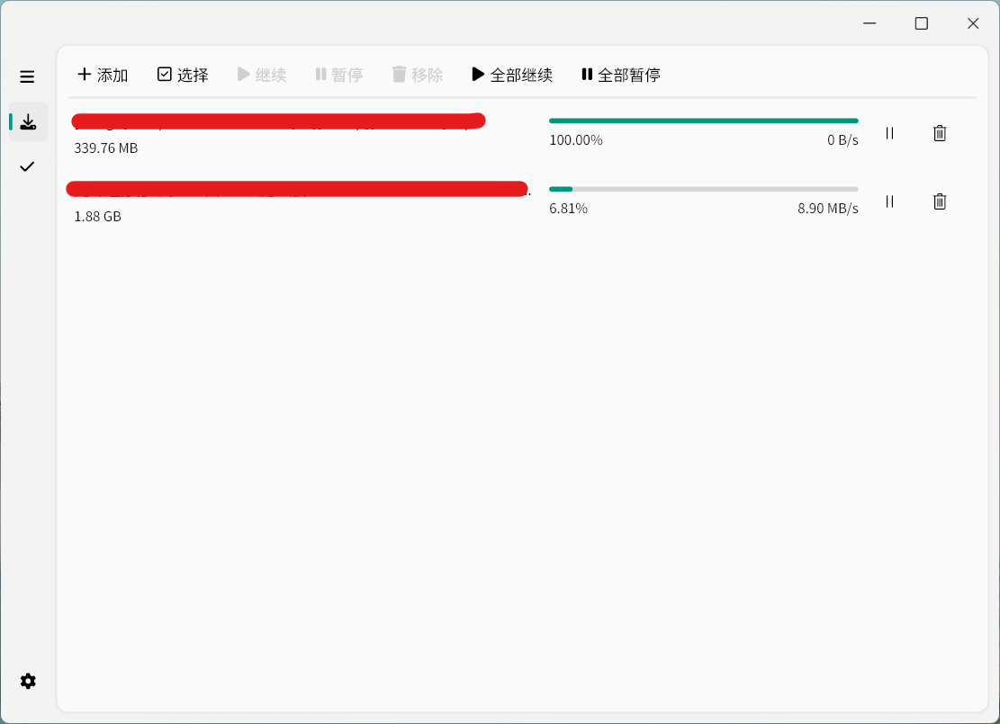

# AriaUI

## 简介

> [!NOTE]
> 注意这是一个Aria2的桌面app，包含常用的一些设置和功能，如果你需要完整功能的Aria GUI，你可以使用[AriaNG](https://github.com/mayswind/AriaNg)

## 截图

## 注意事项

支持的Windows系统: Windows10~

## 更新日志

### 0.1.17 (2024/12/26 仅对macOS系统的更新)
- 添加macOS系统的菜单
- 修复在macOS系统下图标显示问题

过去的版本

### 0.1.16 (2024/12/17)
- 添加复制任务链接的功能

### 0.1.15 (2024/12/6)
- 添加查看任务的文件列表功能
- 添加任务的tooltip功能

### 0.1.14 (2024/11/30)
- 添加修改默认显示顺序的功能
- 修复一些字体显示问题
- 改进了表单输入
- 修改了默认显示顺序

### 0.1.13 (2024/11/20)
- 删除一些不需要的按钮

### 0.1.12 (2024/11/18)
- 添加右键菜单
- 添加许可证页面
- 修复一个文本错误

### 0.1.11 (2024/11/11)
- 添加查看任务详情

### 0.1.10 (2024/11/8)
- 改进数字输入框

### 0.1.9 (2024/10/16)
- 修复预估时间显示错误的问题

### 0.1.8 (2024/10/15)
- 添加预计完成任务时间显示
- 重构了一些变量

### 0.1.7 (2024/10/6)
- 添加新建任务自定义配置的功能

### 0.1.6 (2024/10/4)
- 添加显示上传速度
- 修复一个保存设置的问题

### 0.1.5 (2024/9/15)
- 修复工具栏的一个问题

### 0.1.4 (2024/9/14)
- 添加ratio设置
- 添加排序功能
- 修复操作栏越界的问题

### 0.1.3 (2024/9/12)
- 将新任务放置于前面

### 0.1.2 (2024/8/13)
- 添加全选的按钮
- 改进修改设置判定逻辑

### 0.1.1 (2024/8/8)
- 添加设置修改提示
- 添加Aria2的一些常用设置
- 添加关于对话框

### 0.1.0 (2024/8/2)
- 第一个版本
  

